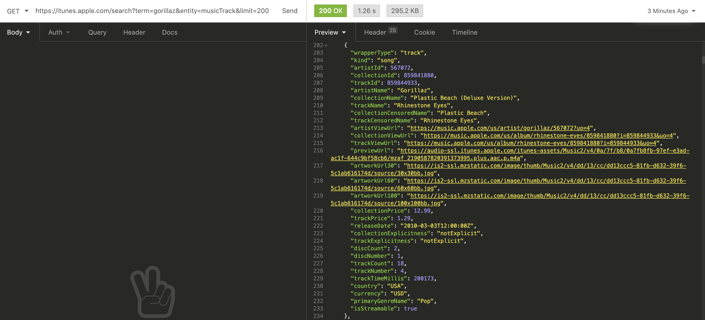

<!--  -->


# General Assembly Project 2: GorillazApp

## Project Brief
This was a pair-coded project completed as part of GA's Software Engineering Immersive course. Our goal was to create a React app with multiple components that consumes a public API of our choice.
## Timeframe
2 days

## Technologies Used
* iTunes Search API
* HTML5
* React.js
* React Router DOM
* JavaScript
* Sass
* Git / GitHub
* Insomnia
* Netlify
* Axios
* Bulma
* Google Fonts
* React Audio Player

## Deployed Version
https://gorillazapp.netlify.app/


## Contributors
* Ashley Smith

## Overview
GorillazApp is a song-shuffler that uses the iTunes Search API.

The user enters the site via a landing page which features a short animation sequence before shuffling through tracks by the band Gorillaz at random. As well as playing a 30 second audio preview, song, artist and album information are displayed on the page next to the release artwork which rotates, replicating the motion of a vinyl turntable.

## Process

### Planning

Our first step was to brainstorm ideas and research potential APIs. I was keen to find a music-based API which led me to find the iTunes Search API.

We used Insomnia to test the API and began exploring the data. It quickly became apparent that we could use the data provided to create a jukebox-style music player.

After some further discussion, we settled on creating an artist-focused app as this would help to inform any styling decisions further down the line.

### Constructing requests

The iTunes Search API returns various different media formats including books and music videos. We refined our search to include only music tracks by adding `entity=musicTrack` to our query.

As outlined in its documentation, the iTunes Search API is limited to approximately 20 calls per minute. We knew therefore that we wanted to request the track data once upon pageload, rather than submitting search requests for individual songs each time the user interacts with the feature.

By default, 50 results are returned. We wanted to include a wider range of tracks than this so extended our search to 200, which is the maximum possible, by also adding `limit=200` to our query.



https://itunes.apple.com/search?term=gorillaz&entity=musicTrack&limit=200

## Development

### Core functionality

We've used React Router DOM to structure our app into separate components. This allowed us to present a landing page (Home.js) and direct the user into the track-show page (TrackShow.js).

The following code handles the core function of our app: generating a random index between 1 and 200 and setting variables based on the data returned from the iTunes Search API.

Our asynchronous HTTP request is handled by axios and nested within the function `getTracks()` as seen below:

```
const [tracks, setTracks] = React.useState(null)
const [trackIndex, setTrackIndex] = React.useState(Math.floor(Math.random() * 199 + 1)
)

React.useEffect(() => {
  const getData = async () => {
    try {
      const { data } = await getTracks()
      setTracks(data)
    } catch (err) {
      console.log(err)
    }
  }
  getData()
}, [])

const currentTrackName = tracks && tracks.results[trackIndex].trackName
const currentCollectionName = tracks && tracks.results[trackIndex].collectionName
const currentArtwork = tracks && tracks.results[trackIndex].artworkUrl100.replace(/100x100/g, '600x600')
const currentAudioSource = tracks && tracks.results[trackIndex].previewUrl

function nextTrack() {  
setTrackIndex(Math.floor(Math.random() * 199 + 1))
}
```

Once the core functionality of the app had been implemented, I worked on the Homepage and loading animations, while Ash focused on the Track Show page. 
### Homepage

An onClick event on the 'Enter Site' button triggers a change in state, as below:

```
  const history = useHistory()
  const [enteredSite, setEnteredSite] = React.useState(false)

const clicksEnter = () => {
  setEnteredSite(true)

  //* This then sends the user to the TRACK SHOW page:
  setTimeout(() => {
    history.push('/trackshow')
  }, 6500)
}
```

Through the use of a ternary operator in the returned JSX, the initial contents of the homepage are hidden and a new set of images are presented to the user, simulating a loading screen.

Nested within the above function, the `setTimeout()` method allows us to delay the process of pushing the user to the Track Show page. During this time a sequence of timed CSS keyframe animations affect the newly displayed content and the React Audio Player plays a short laughing sample taken from a Gorillaz track.

Below is one example of many CSS keyframe animations used:

```
.jeep img {
  height: 400px;
  position: absolute;
  top: 35%;
  opacity: 1;
  animation: drive 6.5s linear;
}

@keyframes drive {
  0% { left: -40% }
  80% { left: 0% }
  100% { left: 100% }
}

```

## Reflection

### Challenges

* **Remote pair-coding:** This was my first project working in a pair. We weren't yet familiar with group Git working so our process was built around screen-sharing and sharing code snippets via Slack.

### Wins

* **Third-party APIs:** Successfully integrating an API into our project was an invaluable process because it highlighted what can be achieved with the tools we've learnt. I'm excited about the prospect of delving deeper into this world and the opportunities created by having accessing to vast streams of data.

### Key Learnings

* **Planning:** This project highlighted the importance of careful planning and communication, particularly when working remotely. At one stage in the process, for example, we were both working separately on styling the same elements and a section of code had to be discarded as a result. Other than this occassion we worked very well together, communicating effectively to resolve any problems that arose with the code.

* **React.js:** Through the implementation of a third-party API and by using conditional rendering to manipulate the contents of a page, I was able to solidfy my knowledge of many of the concepts explored in the second module of the course.

### Bugs

* **Image loading:** If images are slow to load this can affect the CSS animation sequence and this is something I'd like to resolve moving forward.

### Future Improvements

* **Functionality:** We'd initally discussed implementing an audio volume control and the ability to return to the previous track but these ideas were placed on hold due to time constraints. 

* **Scope:**  

## Credits:
* [iTunes Search API](https://developer.apple.com/library/archive/documentation/AudioVideo/Conceptual/iTuneSearchAPI/index.html#//apple_ref/doc/uid/TP40017632-CH3-SW1)
* Audio sample taken from 'Clint Eastwood' by Gorillaz
* This project was bootstrapped with [Create React App](https://github.com/facebook/create-react-app)

